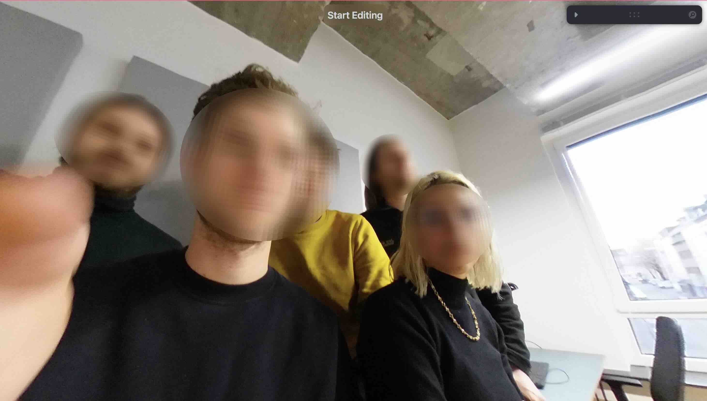
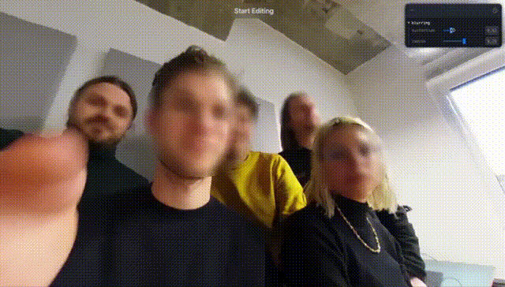
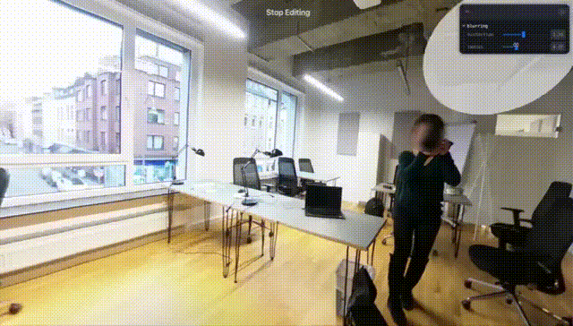

# Face Blurring || Equirectangular Panorama Pictures

This app is designed for manual face blurring in equirectangular panorama images, balancing privacy protection with panoramic immersion. Edit mode offers precise control over blur radius and distortion, with a visual marker for reference. Viewing mode allows full 360-degree exploration, with fast loading and zoom capabilities. This app serves as a demonstrative platform.



## Installation

To get started with the Vite App, follow these installation steps:

1. **Clone the repository:**

   ```bash
   git clone https://github.com/your-username/vite-app.git
  
2. **Go to your file root directory and run the following commands:**

   ```bash
   npm i 
   npm run dev
    
## Instructions once you run the app

Once you run the app, you can enjoy the 360 view of the equirectangular picture, as well as blur faces, to ensure anonymity.

1. **Click and drag to look arround:**
  
2. **Scroll to zoom in and out:**

3. **Click the button to enter edit mode:**

4. **Use the UI:**

    Use the UI to adjust the radius of the blur as well as the blur distortion. Distortion is applied uniformly while the redius size is applied individually based on the setting before applying.

**Distortion**
       
**Radius Resize**
       